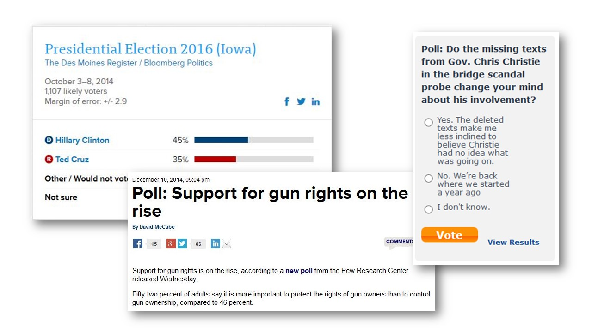
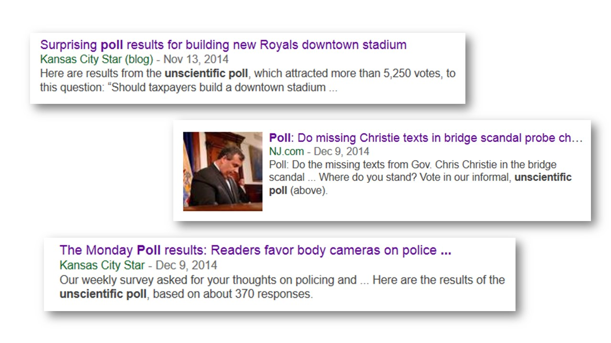

## Opinion polls and surveys are everywhere...

---
## But many of these polls are unscientific...

---
## How to tell the difference?

- A quick way to determine if a reported poll is scientifically valid is to look for a statment like this:

- [Read more on opinion polls at Wikipeida](http://en.wikipedia.org/wiki/Opinion_poll)

---
## Now you can verify (reproduce!) claims about margins-of-error or even design your own poll with this new Shiny app!

Click here to visit app:  https://pinnipedia.shinyapps.io/SampleSize

